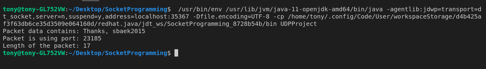
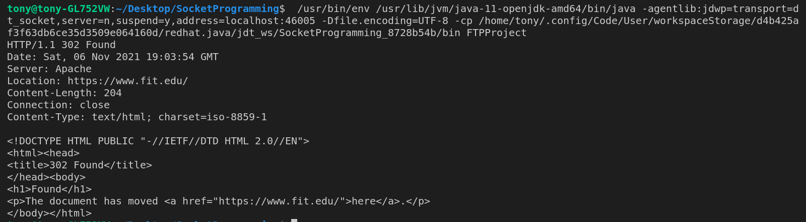
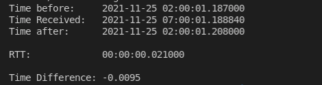

# Networking Assignments
CSE networking class code examples

# Contains...

> Every file uese packet & socket level programming.

1. Private UDP server response handler

  
Result Screen

  

 

2. Public FTP server connection and data request through HTTP request(Also, Includes HTTPS reqyest)

  
Result Screen

  

 

3. Measuring Internet connection time(Round Trip Time) by requesting server time and calculating the time difference between the requested time and the arrival time

  
Result Screen

  

 